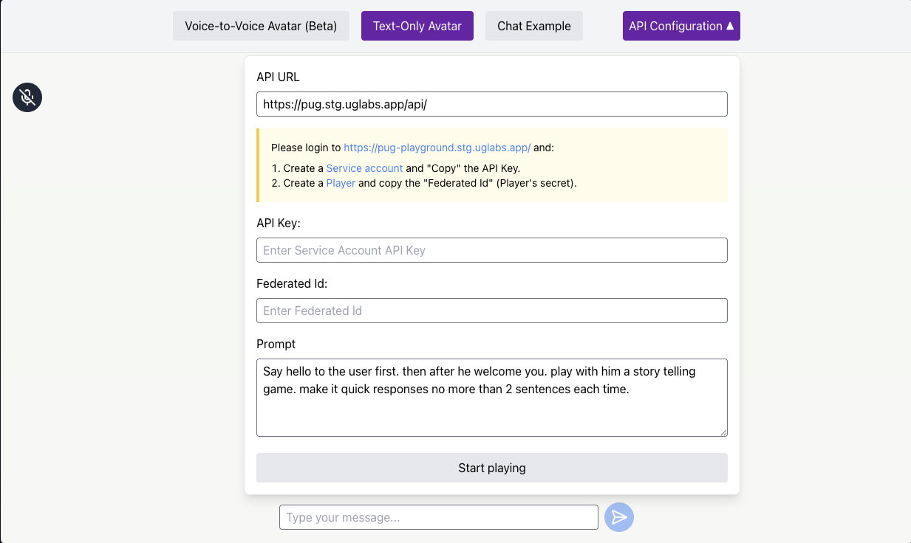
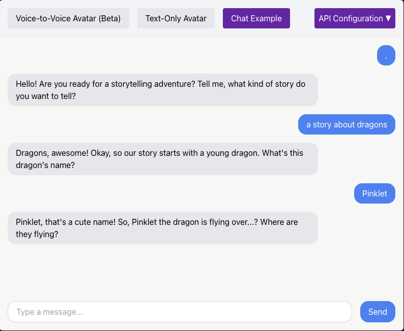
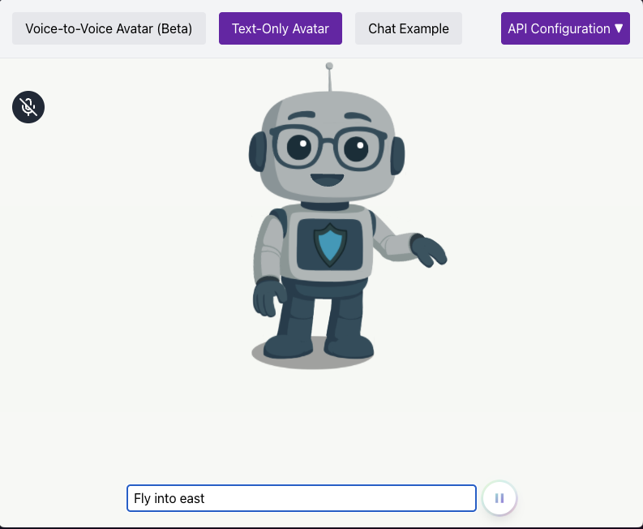

# Playground

To test locally on safari, the dev server runs on HTTPS by default, which is required for microphone access.

When you first access the site at `https://localhost:5173/` (or another port if 5173 is busy), you will need to accept the self-signed SSL certificate in your browser.

```sh
npm run start
```

## Examples

This project provides three examples of using the `ug-js-sdk`:



**Chat Only:** A simple text-based chat interface.


**Voice Audio:** An example demonstrating voice input and audio output.


**Voice to Voice (Beta):** A full voice-to-voice interaction with an avatar.

## Installation

Install:

```shell
$ npm install
```

Start the development server:

```shell
$ npm run start
```

## Build

```shell
npm run build
```

Builds the app for production.
It correctly bundles React in production mode and optimizes the build for performance.

# Libraries

We use @esotericsoftware/spine-player to load up [Spine player](https://en.esotericsoftware.com/spine-player)

# Debugging

For local SDK debugging: Any developer who wants to debug the SDK simply needs to clone the js-sdk repository into the directory next to ug-demos-js.

```
/some-parent-folder
├── /ug-demos-js  <-- your project
└── /js-sdk       <-- the local SDK clone
```

Our Vite config will try to load from that folder first using a path alias.
